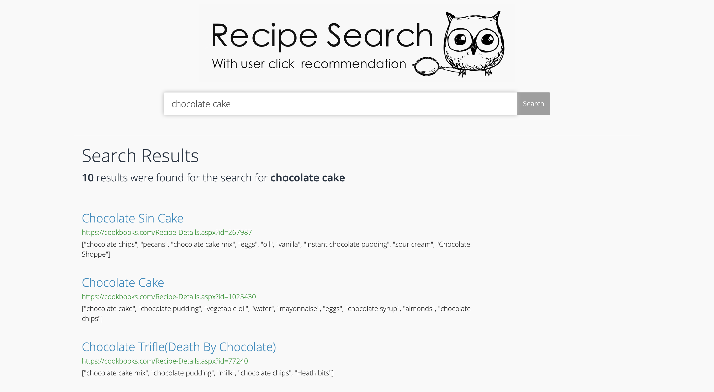
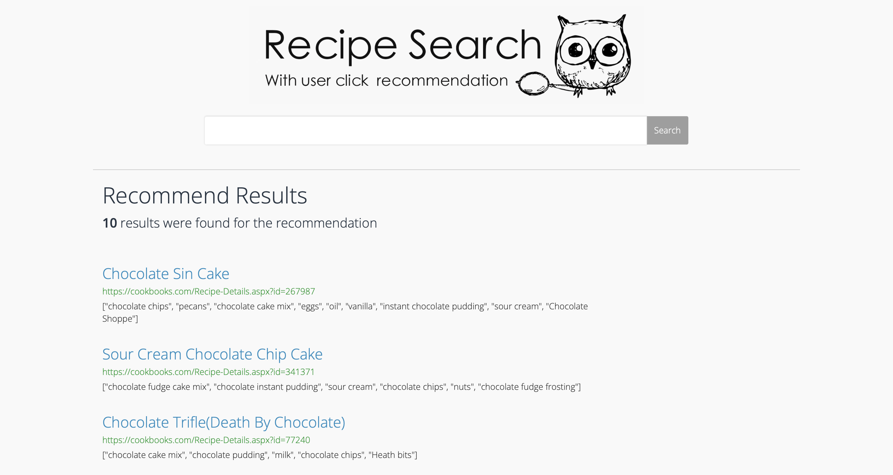

# Recipe Search and Recommendation Engine
## Introduction
This project aims to design and develop a search recommendation engine that can recommend recipes based on users' historical search records in real time. It uses MongoDB as the backend database for storing inverted indexes as well as recipe data. It supports basic inverted index recall as well as TFIDF/BM25 based sorting. Its recommendation module uses the BERT twin-tower model to sort the embeddings of users and recipes by semantic matching, and returns a list of recipes with the highest matching scores. Users only need to click the homepage recommendation button or the icon at the top of the search page to get recommended results with one click.

* The following image is the homepage display of the recipe search recommendation engine:

* The following image is the search page display of the recipe search recommendation engine:

* The following image is the recommendation page display of the recipe search recommendation engine:

## Usage
Go to the recipe-search folder and enter the following command in the terminal:

    python runserver.py
    
   
